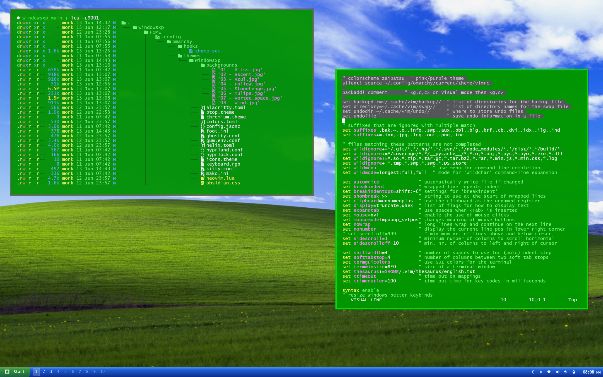

# windowsxp themes for Omarchy
Install:  Jus' figure it out.  Should be straight forward <clone repo;copy/paste dirpaths>.

## The hooks dir
This file is necessary in order to reload the waybar.  Omarchy, v3.8.4, does not
currently have a nice implementation for very different waybar styles.

## Helix (non-omarchy users)
Each theme ships a `helix.toml` in its theme dir.  Copy it to
`~/.config/helix/themes/windowsxp.toml` (or `windowsxp-green.toml`)
and add `theme = "windowsxp"` to `~/.config/helix/config.toml`.

## Make Vim theme file work
silent! source ~/.config/omarchy/current/theme/vimrc\
You need to add the above line to your .vimrc file.

# License
You must say "Deus vult" out loud when you clone this directory, if you
do not clone, well then you are in luck (or out of luck, however you
wish to think of it).

