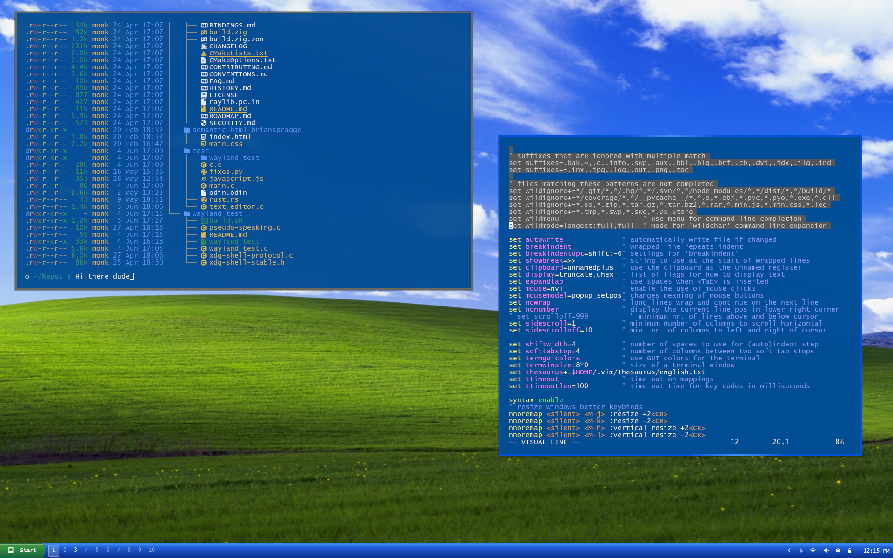

# windowsxp theme for Omarchy
Take what you like from this.  It got a lot of likes on X, so I assume
some of ya'll might want it.  It is your responsibility to check the
integrity of the code.  It was generated with Opencode.  Enjoy!

## The hooks dir
This file is necessary in order to reload the waybar.  Omarchy does not
currently have a nice implementation for very different waybar styles.

# License
You must say "Deus vult" out loud when you clone this directory, if you
do not clone, well then you are in luck (or out of luck, however you
wish to think of it).

